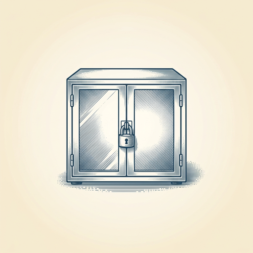
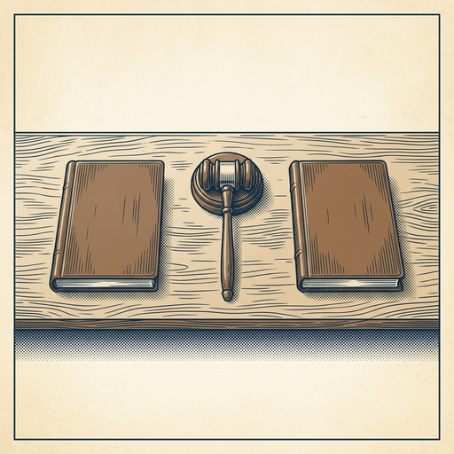
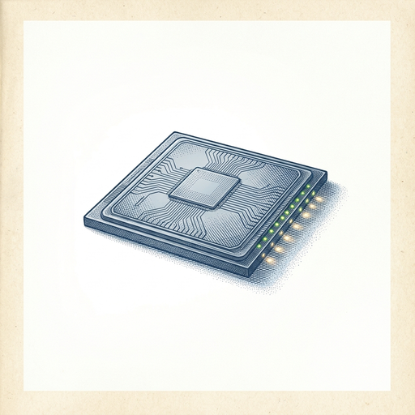

# ai espresso ☕ — Edition 18 · Variant C (Newspaper Comic · Snackable)

*your morning cup of AI*
**SAT · JUN 13 · 2026**

---



**NEWS**

## US government orders Anthropic to suspend two of its AI models

Anthropic announced it's suspending access to Fable 5 and Mythos 5 following a federal directive. The company hasn't disclosed what triggered the order or when access might resume. This marks the first known case of the US government forcing an AI lab to pull specific models from service.

*First time we've seen the feds directly shut down commercial AI models*

[Anthropic News](https://www.anthropic.com/news/fable-mythos-access) · Jun 13

---


**NEWS**

## Apple's new Siri can finally do more than set timers

After fifteen years of being barely useful, Siri just got a major upgrade that actually works. The Verge's latest Vergecast digs into what changed and whether Apple's assistant can finally compete with ChatGPT and Alexa.

*If Siri actually works now, your phone just became more useful than your laptop for daily tasks.*

[The Verge — AI](https://www.theverge.com/podcast/949079/siri-ai-good-vergecast) · Jun 13

---



**NEWS**

## Judge cancels trial after discovering both sides used AI to write their briefs

A federal judge in Florida canceled a trial and removed all attorneys from a case after learning lawyers on both sides submitted AI-generated legal arguments. The judge called it a breakdown of the adversarial system when 'two AIs argue against each other' instead of human lawyers doing actual legal work.

*Courts are starting to punish lawyers who let AI do their jobs instead of using it as a tool*

[404 Media](https://www.404media.co/judge-learns-lawyers-on-both-sides-of-case-used-ai-cancels-trial-kicks-everyone-off-the-case/) · Jun 13

---



**NEWS**

## NVIDIA's new Blackwell chip runs 20x more AI agents per megawatt

AgentPerf — the first industry benchmark for agentic AI infrastructure — just posted results showing NVIDIA's Blackwell Ultra NVL72 platform leading across workloads. The chip runs 20x more agents per megawatt than NVIDIA's previous generation, giving developers and enterprises a standard way to compare systems built for multi-agent tasks.

*First real benchmark for comparing infrastructure built to run lots of agents at scale.*

[NVIDIA Blog](https://blogs.nvidia.com/blog/nvidia-blackwell-agentperf-artificial-analysis/) · Jun 13

---


---


**☕ Try this prompt**

### The skill gap map

*When you're past the tutorials but still feel like a fraud.*


```
I want to get better at something I'll describe below. Don't give me a learning plan. Instead: tell me the one sub-skill experts have that beginners don't even know exists, the specific moment I'll notice I've acquired it, and one person I should watch to see it in action.
```

---

*brewed by ai espresso · [spot something off?](mailto:jhimel@solvd.com?subject=AI%20Espresso%20issue%20report) · [repo](https://github.com/jackiehimel/AI-espresso-agent)*
