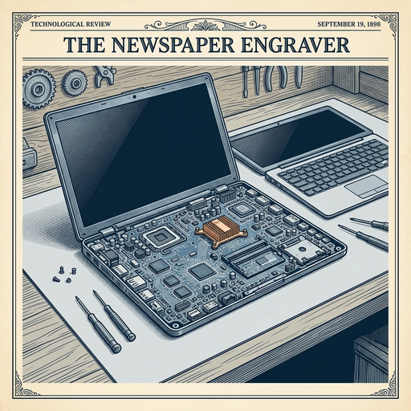

# ai espresso ☕ — Edition 19 · Variant C (Newspaper Comic · Snackable)

*your morning cup of AI*
**SUN · JUN 14 · 2026**

---


**NEWS**

## Court rules Google is liable when AI Overviews make false claims

A judge held Google legally responsible for damages from false statements generated by its AI Overviews feature. The ruling says companies that design, train, and operate AI systems must assume liability for what those systems output — not just host it like a neutral platform.

*Tech companies can't treat their own AI as someone else's content they're just hosting.*

[Wired — AI](https://www.wired.com/story/a-court-has-ruled-that-google-is-liable-for-false-statements-generated-by-ai-overviews/) · Jun 14

---


**NEWS**

## Apple's camera chief says AI will add fake pixels to your photos in iOS 27

The next Photos app will use generative AI to fill in parts of your shots with synthetic pixels. Apple's Jon McCormack frames it as giving users 'superpowers' rather than using AI for its own sake, though the company is clearly betting people want their memories enhanced by algorithms.

*Apple is now comfortable shipping AI that literally fabricates parts of your personal photos.*

[Wired — AI](https://www.wired.com/story/apple-camera-chief-thinks-ai-can-give-you-superpowers/) · Jun 14

---



**NEWS**

## The engineer who built OpenAI's coding tools is now rebuilding all of ChatGPT

Thibault Sottiaux led the team that turned ChatGPT into a coding assistant used by millions of developers. Now he's running a complete overhaul of how ChatGPT works under the hood—moving it from a chatbot to something more like an operating system that can run tools, search the web, and take action.

*ChatGPT is shifting from answering questions to actually doing things for you.*

[Wired — AI](https://www.wired.com/story/model-behavior-interview-with-openai-codex-lead-tibo-sottiaux/) · Jun 14

---


---


**☕ Try this prompt**

### The career bet scorecard

*When you're comparing offers but all the spreadsheets feel bloodless.*


```
I'll describe my current role and one opportunity I'm considering. For each, score three things out of 10: how much I'll learn in the next 18 months, how much leverage it builds for the move after this one, and how energized I'll feel on a random Wednesday. Then tell me which matters most and why.
```

---

*brewed by ai espresso · [spot something off?](mailto:jhimel@solvd.com?subject=AI%20Espresso%20issue%20report) · [repo](https://github.com/jackiehimel/AI-espresso-agent)*
