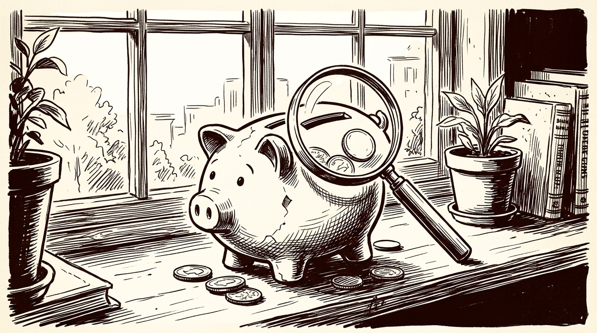
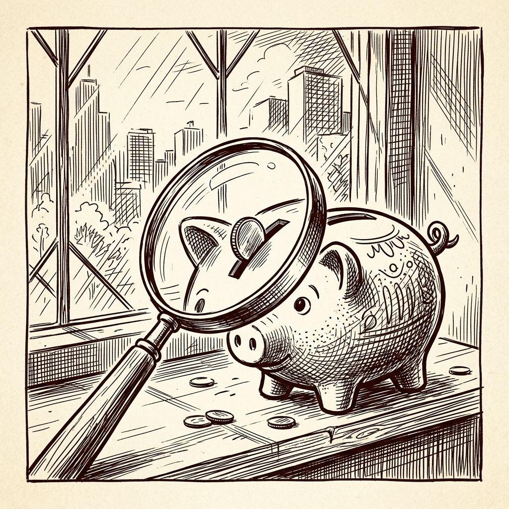

# ai espresso ☕ — Edition 3 · Variant C (Newspaper Comic · Snackable)

**MON · MAY 18 · 2026**

---


**MARKET**

## Cerebras stock jumps 89% on debut as AI chip maker goes public

Cerebras, which makes wafer-scale AI chips that compete with Nvidia, started trading Thursday and nearly doubled in its first day. The IPO comes as SpaceX, OpenAI, and Anthropic are all preparing their own public offerings.

*The AI infrastructure boom is creating a new generation of publicly traded companies beyond just Nvidia.*

[NYT — Technology](https://www.nytimes.com/2026/05/14/technology/cerebras-ipo-ai.html) · May 18

---



**FOR YOU**

## ChatGPT can now connect to your bank account and track spending

OpenAI added personal finance tools that let ChatGPT pull real transaction data from your checking account, categorize purchases, and answer questions like 'how much did I spend on restaurants last month?' It works through Plaid, the same service Venmo and other apps use to connect banks.

*AI assistants are moving from answering questions to handling actual money tasks*

[9to5Mac — AI](https://9to5mac.com/2026/05/15/openai-just-released-new-personal-finance-features-for-chatgpt-customers/) · May 18

---


**BUILD**

## CFTC is using AI to spot insider trading on Polymarket and Kalshi

The US derivatives regulator now runs machine learning models that flag suspicious betting patterns on prediction markets—like someone consistently winning on FDA approval dates or Fed announcements before they happen. The system watches for clusters of accurate bets from new accounts, unusual timing, and coordination across platforms.

*Prediction markets are becoming real enough that regulators treat them like securities exchanges*

[Ars Technica — AI](https://arstechnica.com/tech-policy/2026/05/the-us-is-betting-on-ai-to-catch-insider-trading-in-prediction-markets/) · May 18

---


---



**☕ Try this prompt**

### Sanity-check my spending with AI


```
**Review my spending this month and surface what I'm missing.**
Here's my data:
[paste transactions, categories, or a CSV export]
Flag three surprises — patterns I might not see on my own. Call out one likely mistake (duplicate charge, weird category, etc.). Then suggest one small change I'd realistically stick to for 30 days.
End with a single sentence: "If you only do one thing, do X."
```

Works in ChatGPT (with bank connections), Claude, or Gemini.

---

*brewed by ai espresso · [spot something off?](mailto:jacqueline.himel@vanderbilt.edu?subject=AI%20Espresso%20issue%20report) · [repo](https://github.com/jackiehimel/AI-ESPRESSO-MAIN)*
