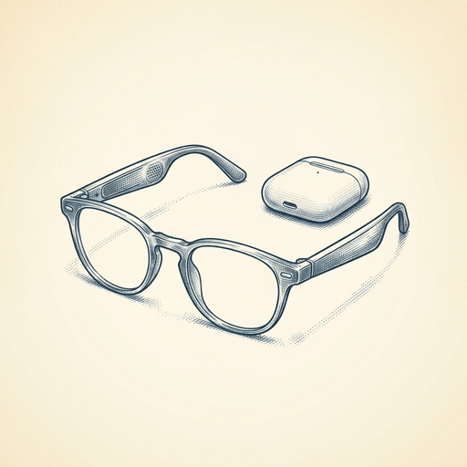

# ai espresso ☕ — Edition 5 · Variant C (Newspaper Comic · Snackable)

**TUE · MAY 19 · 2026**

---


**MARKET**

## Cursor just acquired Supermaven, the autocomplete startup that beat Copilot

Cursor bought Supermaven, the AI coding assistant known for its fast, context-aware autocomplete. Supermaven's founder Jacob Jackson and team are joining Cursor to work on next-gen code prediction. The deal consolidates two of the few companies that built their own autocomplete models instead of relying on OpenAI or Anthropic.

*The best independent autocomplete tech now powers the most popular AI code editor.*

[Cursor Blog (official)](https://cursor.com/blog/supermaven) · May 19

---



**EVERYDAY**

## Google just made Gemini speak, see, and hear at the same time

Gemini Omni is Google's new model that processes video, audio, and text simultaneously — not one after another. You can show it something on screen, ask a question out loud, and it responds in voice without converting everything to text first. Rolling out in Gemini Advanced and the app soon.

*Computers are starting to work the way humans do — taking in everything at once instead of one sense at a time.*

[Google DeepMind Blog](https://deepmind.google/blog/introducing-gemini-omni/) · May 19

---


**INDUSTRY**

## Anthropic just bought the company that builds its SDK

Anthropic acquired Stainless, the startup behind its official API libraries in Python, TypeScript, and Go. Stainless will keep running as an independent team inside Anthropic, maintaining both Anthropic's SDKs and the open-source tools other companies use to generate their own client libraries.

*When the AI company buys its API tooling team, expect tighter integration between models and code.*

[Anthropic News](https://www.anthropic.com/news/anthropic-acquires-stainless) · May 19

---


---


**☕ Try this prompt**

### The ghost writer check

*After you've AI-drafted anything with your name on it.*


```
I just wrote something that needs to sound like me, not like AI smoothed all the edges off. Read what I'm pasting below. Then tell me which three sentences sound like they came from a corporate template instead of a human brain. Rewrite only those three — keep my weird phrasing everywhere else.
```

---

*brewed by ai espresso · [spot something off?](mailto:jhimel@solvd.com?subject=AI%20Espresso%20issue%20report) · [repo](https://github.com/jackiehimel/ai-espresso-finalized)*
