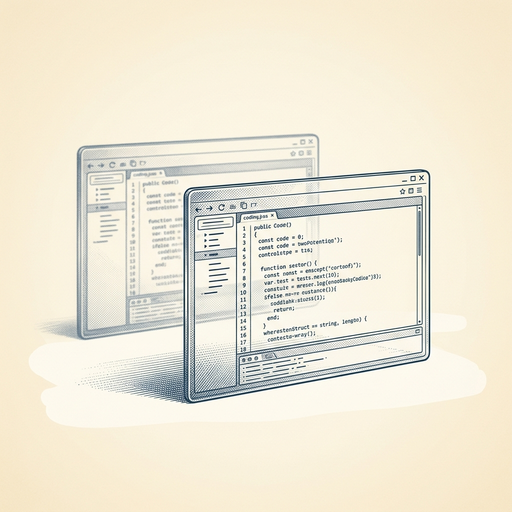

# ai espresso ☕ — Edition 7 · Variant C (Newspaper Comic · Snackable)

*your morning cup of AI*
**THU · MAY 28 · 2026**

---


**MARKET**

## Mystery model Hy3 is crushing GPT-4o on OpenRouter's leaderboard

An unidentified LLM called Hy3 has shot to the top of OpenRouter's user preference rankings, beating established models by a significant margin. No one knows who built it, what architecture it uses, or how it's trained—but developers are routing real queries to it.

*A completely anonymous AI model is now handling production workloads based purely on performance.*

[Hacker News (front page)](https://minimaxir.com/2026/05/openrouter-hy3/) · May 28

---


**EVERYDAY**

## You can now run AI chatbots directly on your iPhone

Several apps let you download and run AI models locally on your iPhone — no internet required. Your conversations stay on your device, and the chatbot works offline. The tradeoff: local models are smaller and less capable than cloud versions like ChatGPT.

*Privacy-conscious users get AI without sending data to servers.*

[Engadget — AI](https://www.engadget.com/2182517/how-to-run-local-ai-chatbot-iphone/) · May 28

---


**BUILD**

## Anthropic just released Claude Opus 4.8, its most capable model yet

Claude Opus 4.8 is now available across all tiers. Anthropic says it outperforms the previous flagship on complex reasoning, coding, and extended context tasks, while maintaining the same speed and pricing as Opus 4.

*The new flagship raises the bar for what production AI can handle without changing your budget.*

[Anthropic News](https://www.anthropic.com/news/claude-opus-4-8) · May 28

---



**INDUSTRY**

## BMW puts humanoid robots on its assembly line in Europe

BMW is deploying humanoid robots at a European car plant, expanding a trial that started in the US. The robots are designed to work alongside humans on tasks like installing door seals and moving parts—jobs that are physically demanding or repetitive.

*Humanoid form factor means existing factory layouts don't need rebuilding for automation.*

[BBC Technology](https://www.bbc.com/news/articles/cgmpwzzvxr2o?at_medium=RSS&at_campaign=rss) · May 28

---


---


**☕ Try this prompt**

### The jargon translator

*Before sending anything to a new stakeholder, contractor, or your future self in six months.*


```
I'm about to paste something I wrote that sounds too clever or too internal. Rewrite it so a smart outsider—someone who doesn't work here—gets it in one read. Keep my point, lose the acronyms and insider shorthand. If a sentence needs a glossary, kill it.
```

---

*brewed by ai espresso · [spot something off?](mailto:jhimel@solvd.com?subject=AI%20Espresso%20issue%20report) · [repo](https://github.com/jackiehimel/AI-espresso-agent)*
