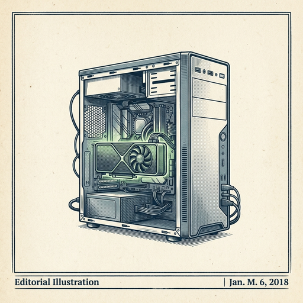

# ai espresso ☕ — Edition 8 · Variant C (Newspaper Comic · Snackable)

*your morning cup of AI*
**TUE · JUN 2 · 2026**

---


**MARKET**

## Anthropic just filed to go public

The ChatGPT rival behind Claude confidentially submitted its S-1 to the SEC, the first step toward an IPO. No timeline or valuation details are public yet, but the move signals Anthropic is preparing to raise capital as an independent company rather than get acquired.

*The AI model race now has its first major public offering on deck*

[Anthropic News](https://www.anthropic.com/news/confidential-draft-s1-sec) · Jun 2

---


**EVERYDAY**

## Google's new Gemini can watch videos and answer questions in real time

Gemini Omni processes live video streams—not just uploaded clips—so you can point your phone at something and ask questions as it happens. The demos show it identifying plants, reading signs in foreign languages, and explaining what's happening in a scene while you record.

*First widely available model that works like having someone watch over your shoulder and explain things.*

[Google AI Blog](https://blog.google/innovation-and-ai/models-and-research/gemini-models/gemini-omni-3-5-videos/) · Jun 2

---



**INDUSTRY**

## Nvidia just announced it's making PC chips — and rivals' stocks fell

Nvidia said it will start building chips for consumer PCs, not just data center GPUs. Wall Street immediately sent AMD, Intel, and Qualcomm shares lower, recognizing that the AI chip leader now wants to own the entire computing stack — from your laptop to the cloud.

*Nvidia is moving from powering AI in the cloud to potentially running it on every device you own.*

[CNBC — Technology](https://www.cnbc.com/2026/06/02/nvidias-new-pc-chips-are-ceos-bid-to-own-every-part-of-ai-stack.html) · Jun 2

---


**BUILD**

## Cursor can now code for longer without asking for permission

Auto-review is a new run mode in Cursor that lets the AI agent work through coding tasks with fewer approval prompts. It's designed to handle longer sessions while keeping execution safe—basically letting you step away while it makes progress on multi-step changes.

*Coding agents just got less chatty and more autonomous for extended work sessions.*

[Cursor Changelog (official)](https://cursor.com/changelog/auto-review) · Jun 2

---


---


**☕ Try this prompt**

### The zombie sentence audit

*When your draft feels long but you can't figure out why.*


```
Read the paragraph I'm about to paste. Flag every sentence that survives only because I'm afraid to delete it — the hedge, the throat-clear, the sentence that just restates the one before it. Then rewrite the whole thing using only the sentences that do actual work.
```

---

*brewed by ai espresso · [spot something off?](mailto:jhimel@solvd.com?subject=AI%20Espresso%20issue%20report) · [repo](https://github.com/jackiehimel/AI-espresso-agent)*
