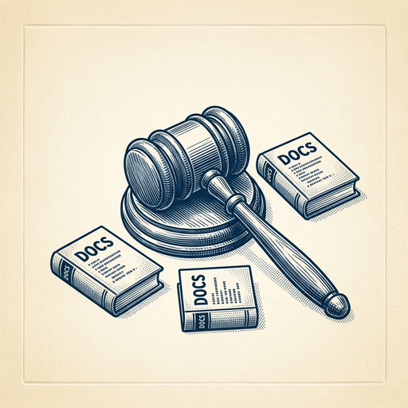
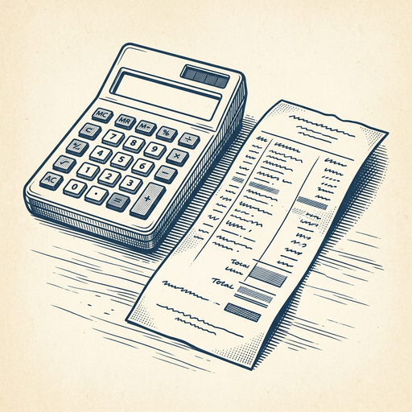

# ai espresso ☕ — Edition 9 · Variant C (Newspaper Comic · Snackable)

*your morning cup of AI*
**WED · JUN 3 · 2026**

---


**MARKET**

## Sam Altman invited to G7 summit by France's Macron

French President Emmanuel Macron invited OpenAI CEO Sam Altman to attend the G7 summit, continuing France's push to court major tech leaders as the country works to strengthen its AI infrastructure and capabilities.

*AI policy is moving from tech conferences to the table where heads of state set global priorities*

[CNBC — Technology](https://www.cnbc.com/2026/06/03/openai-sam-altman-g7-macron-france-big-tech.html) · Jun 3

---



**EVERYDAY**

## New tool makes three AI models debate your code before writing it

Mysti is a coding tool that asks Claude, Codex, and Gemini to argue about how to solve your problem, then synthesizes their ideas into actual code. Instead of getting one model's answer, you see the debate and get code informed by all three perspectives.

*Multi-model debate could catch more edge cases than any single AI would alone.*

[news.ycombinator.com](https://news.ycombinator.com/item?id=46365105) · Jun 3

---


**BUILD**

## Google is paying Android developers for their app code to train AI

Google launched a quiet program offering Play Store developers payment in exchange for their source code. The company isn't saying what models it's training or how the code will be used, but developers are being asked to sign confidentiality agreements as part of the deal.

*Big tech is now directly buying private codebases to feed AI models, not just scraping public repos.*

[404 Media](https://www.404media.co/google-is-quietly-buying-code-from-play-store-developers-to-train-ai/) · Jun 3

---


**INDUSTRY**

## UK forces Google to let publishers block their content from AI Search

Britain's competition regulator just ruled that Google must give website owners a way to opt out of AI Overviews and stop their content from training Google's models. Publishers can now block AI features while still appearing in regular search results—something Google previously bundled together.

*First major regulatory win giving publishers granular control over how AI uses their content.*

[The Verge — AI](https://www.theverge.com/tech/942302/google-search-ai-overviews-uk-cma-publisher-opt-out) · Jun 3

---


---



**☕ Try this prompt**

### The confidence audit

*Before you ship the memo, the blog post, or the exec summary.*


```
I'm about to paste something I wrote that needs to sound authoritative. Hunt for hedging words — maybe, possibly, might, could, somewhat, fairly, relatively. Show me the sentence count before and after killing them. Then flag any survivor that's actually doing useful work protecting me from being wrong.
```

---

*brewed by ai espresso · [spot something off?](mailto:jhimel@solvd.com?subject=AI%20Espresso%20issue%20report) · [repo](https://github.com/jackiehimel/AI-espresso-agent)*
