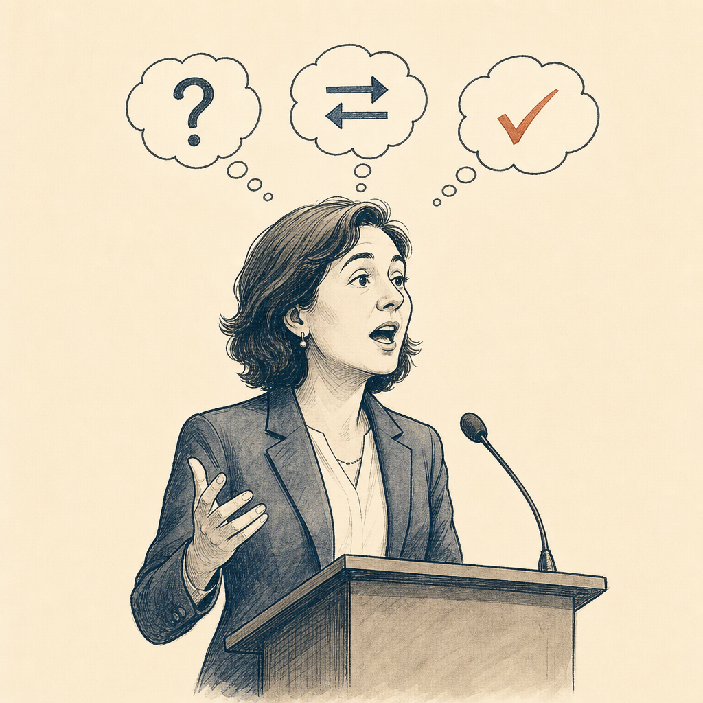
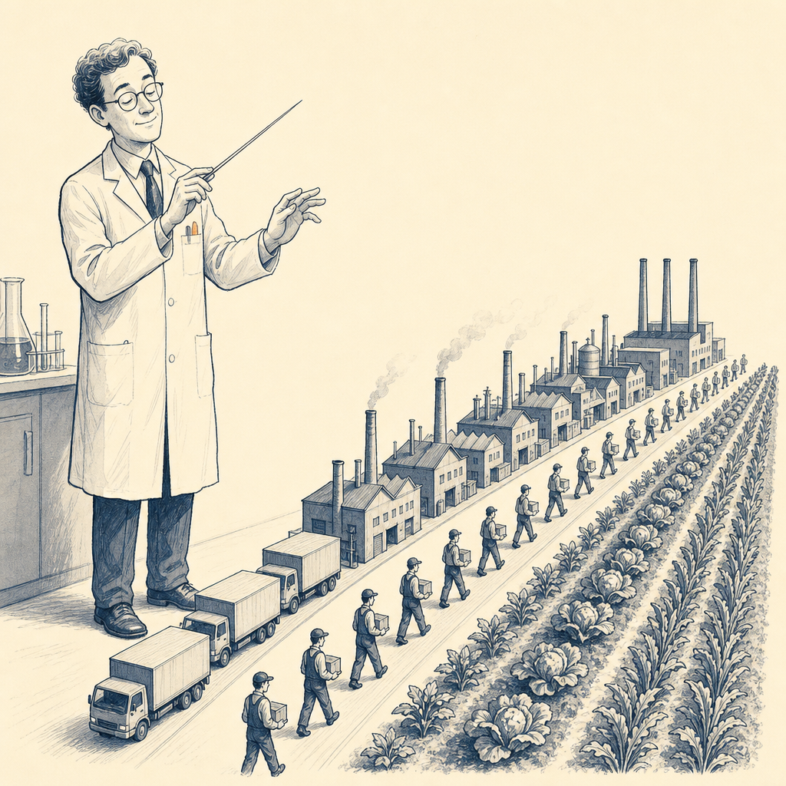

# ai espresso ☕ — Edition 0 · Variant C (Newspaper Comic · Snackable)

**MON · MAY 11 · 2026**

*Rivals teamed up. Voice got smarter. And AI started running a Fortune-500 supply chain.*

---


**ENTERPRISE**

## Anthropic just rented Elon Musk's entire Colossus cluster

Anthropic signed an estimated **$5B/year deal** to rent xAI's full 300MW Colossus cluster.

*Six months ago Musk was trashing Anthropic publicly — now he's their landlord.*

[Latent Space](https://www.latent.space/p/ainews-anthropic-spacexais-300mw5byr) · May 7

---



**TOOLS**

## OpenAI's voice agents can think while they talk

OpenAI shipped **three new realtime voice models** that reason, translate, and transcribe at once — **+15.2%** on Big Bench Audio.

*Voice agents have been stuck on "transcribe-then-respond" since GPT-4o; they can finally think mid-sentence.*

[OpenAI](https://openai.com/index/advancing-voice-intelligence-with-new-models-in-the-api) · May 7 · also [Latent Space](https://www.latent.space/p/ainews-gpt-realtime-2-translate-and)

---



**ENTERPRISE**

## DeepMind's AlphaEvolve is running BASF's supply chain

A Gemini-powered agent is now running supply chain calls across BASF's **180 production sites** — same agent that designed circuits in Google's next-gen TPUs.

*"Agentic AI in production" finally has a Fortune-class receipt, not a demo.*

[Google Cloud](https://cloud.google.com/blog/products/ai-machine-learning/how-basf-manages-thousands-of-supply-chain-decisions-with-alphaevolve/) · May 7 · also [DeepMind](https://deepmind.google/blog/alphaevolve-impact/)

---


**☕ TRY THIS PROMPT**

## The adversarial code reviewer

Paste a PR diff into Claude or ChatGPT with this. No diplomatic softening.

```
You're a senior staff engineer reviewing this PR. Be the toughest
reviewer on the team — find every bug, race, edge case, security
issue, and architectural mistake. No softening. Cite the line for
each finding. End with a verdict: Approve, Request Changes, or Reject.
```

Best on diffs <500 lines. Pair with `git diff main...HEAD | pbcopy`.

---

*brewed by ai espresso · [spot something off?](mailto:jacqueline.himel@vanderbilt.edu?subject=AI%20Espresso%20issue%20report) · [source allowlist](https://github.com/jackiehimel/ai-espresso/blob/main/feeds.json)*
